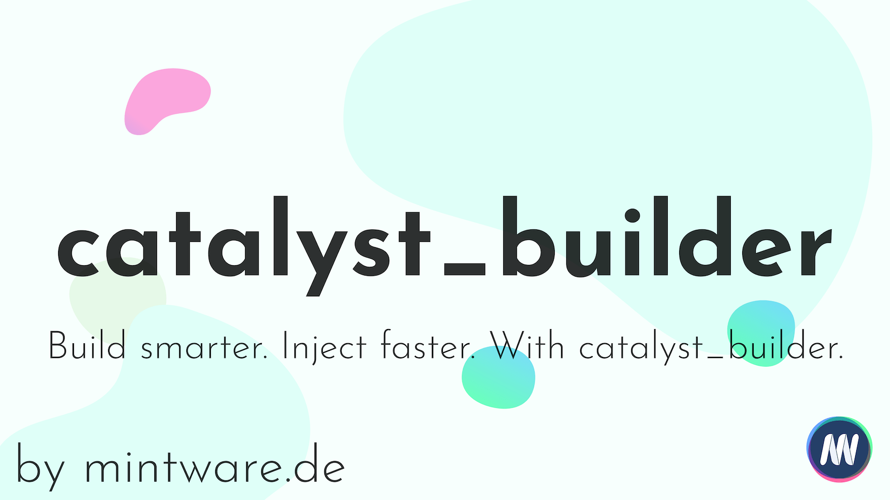
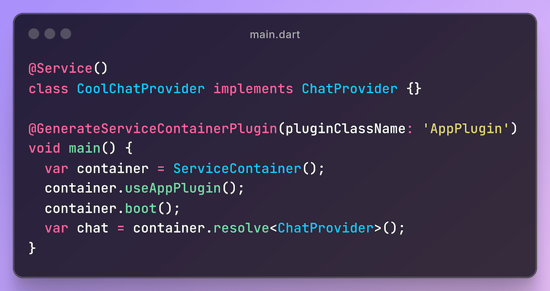

[](https://github.com/mintware-de/catalyst_builder/blob/main/packages/catalyst_builder/LICENSE)


[](https://pub.dartlang.org/packages/catalyst_builder)


# Catalyst Builder

A dependency injection provider builder for dart.

Click on the image for a video on YouTube:

[](https://youtu.be/aJO7_bCOHRs?si=t9lhwQ5v31z-p4iw)

## Screenshot



## Background

Since [Catalyst](https://github.com/mintware-de/catalyst) is only for Dart
and [Flutter Catalyst](https://github.com/mintware-de/flutter_catalyst)
supports Flutter, but a mess to configure I decided to do something cooler.

Catalyst Builder is a dependency injection provider builder for both, Dart and Flutter. It's easy to use and dependency
injection is almost done automatically. You only have to decorate your services with `@Service` and the build_runner
will create a service provider for you.

## Installation

Follow the steps described on this Page:
https://pub.dev/packages/catalyst_builder/install

Add this to your pubspec.yaml and run `pub get` or `flutter pub get`:

```yaml
dev_dependencies:
  build_runner: ^2.2.0
```

Don't forget to exclude the `.catalyst_builder_cache` directory from VCS.


## Documentation

Check out the [wiki on GitHub](https://github.com/mintware-de/catalyst_builder/wiki) for documentation
